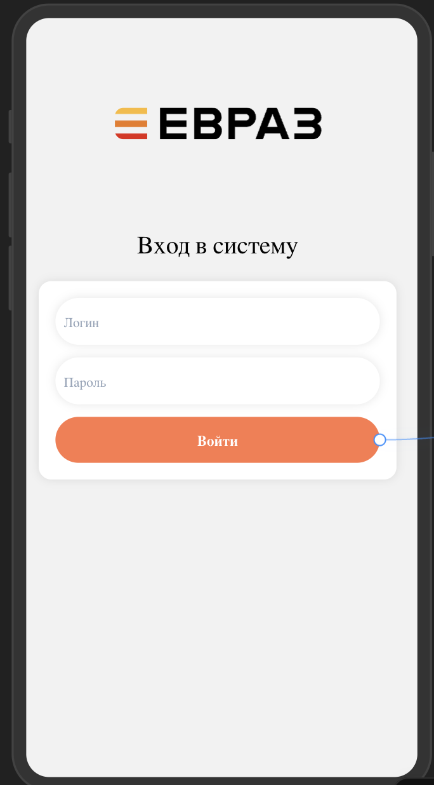
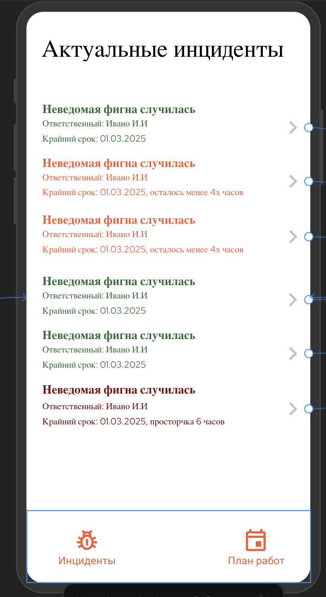
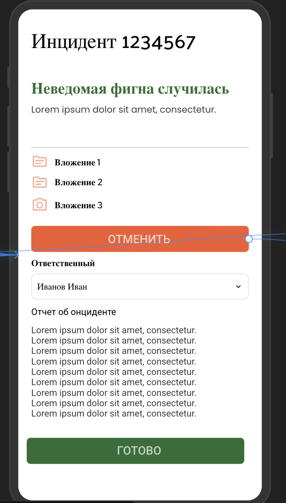
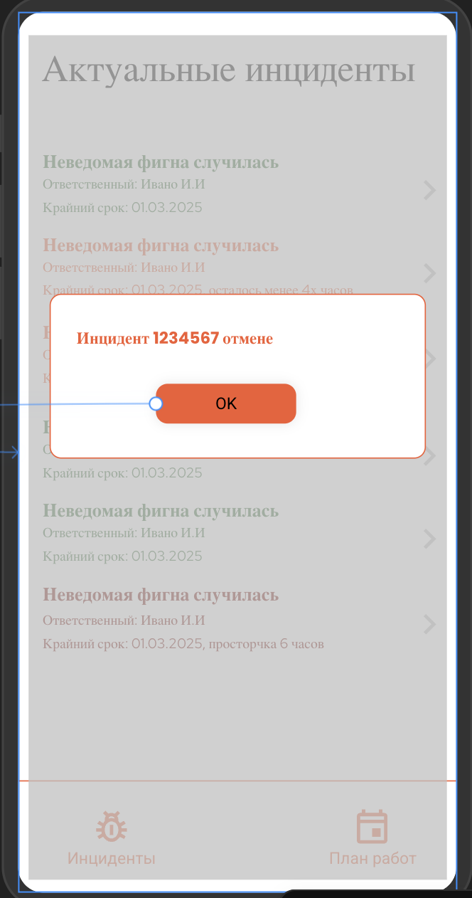

## 1. Целевая аудитория и портрет пользователя

Приложение предназначено для двух категорий пользователей:

1. **Руководители проектов** – заинтересованы в оперативной реакции специалистов на инциденты (ошибки в логике приложений, инфраструктуре и пр.), а также в своевременном внесении трудозатрат на проекты. Руководители проектов назначают ответственных за устранение инцидентов.
2. **Специалисты** – получают уведомления об инцидентах, анализируют их, принимают в работу или отклоняют, а также вносят информацию о своих трудозатратах.

## 2. Основные функции

1. **Просмотр информации об инциденте:**
   - Дата заведения инцидента
   - Описание инцидента
   - Вложения
   - Дэдлайн
2. **Обработка инцидента:**
   - Возможность отклонить инцидент
   - Принятие инцидента в работу
3. **Оповещения:**
   - Получение push-уведомлений о новых инцидентах
4. **План работ:**
   - Просмотр плана работ на текущий месяц в виде списка
5. **Отчетность:**
   - Внесение информации о трудозатратах по конкретным пунктам плана за текущий день

## 3. Архитектура и технические решения

**Платформы:** iOS и Android (Kotlin Multiplatform - KMP)
**Бэкенд:** Kotlin + Ktor
**Интеграция:** PMSYS через БД или веб-сервисы
**Дизайн:** Соответствует дизайн-коду компании Евраз
**Монетизация:** Отсутствует

## 4. Функциональные модули и экраны

### 4.1 Экран авторизации

- Вход по логину и паролю
- Интеграция с системой аутентификации PMSYS

### 4.2 Главный экран - Экран списка открытых инцидентов

- Отображение списка всех открытых инцидентов
- Указание крайнего срока исполнения инцидента
- Информация об ответственном за инцидент
- Цветовое выделение инцидентов:
  - **Зеленый** – до крайнего срока больше 4 часов
  - **Оранжевый** – менее 4 часов до крайнего срока
  - **Красный** – просрочка инцидента менее 4 часов
  - **Бордовый** – просрочка инцидента более 4 часов

### 4.3 Экран инцидента

- Полное описание инцидента
- Кнопки отклонения/принятия инцидента в работу
- Вложения
- Дэдлайн

### 4.5 Экран плана работ

- Список задач на текущий месяц
- Детализация по каждому пункту

### 4.6 Экран отчета о трудозатратах

- Выбор пункта плана
- Внесение информации о затраченном времени
- Подтверждение ввода

## 5. Навигация

1. Авторизация → Главный экран
2. Главный экран → Экран списка открытых инцидентов → Экран инцидента
3. Главный экран → Экран плана работ → Экран отчета о трудозатратах

## 6. Технические аспекты

- **UI:** Jetpack Compose (Android) и SwiftUI (iOS) через KMP
- **Логика:** Kotlin Multiplatform (KMP) для бизнес-логики
- **Сетевой слой:** Ktor Client для работы с PMSYS API
- **Push-уведомления:** Firebase Cloud Messaging (FCM)
- **Хранение данных:** Local Storage (SQLDelight для офлайн-режима)